# Сравнение хэш-функций
## Гистограммы заселенности
### Размер хэш-таблицы 5013
### Всегда возвращает 1
<p align="center">
    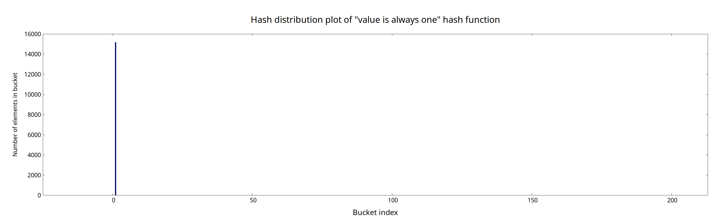
</p>

### Возвращает первую букву слова
<p align="center">
    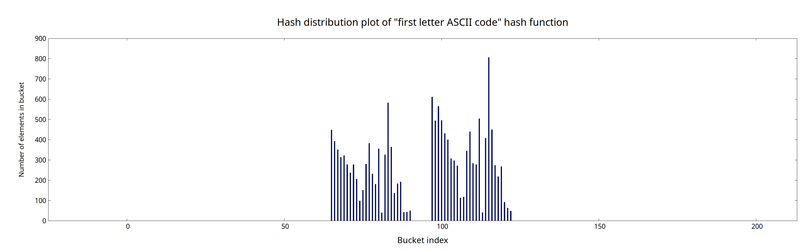
</p>

### Возвращает длину слова
<p align="center">
    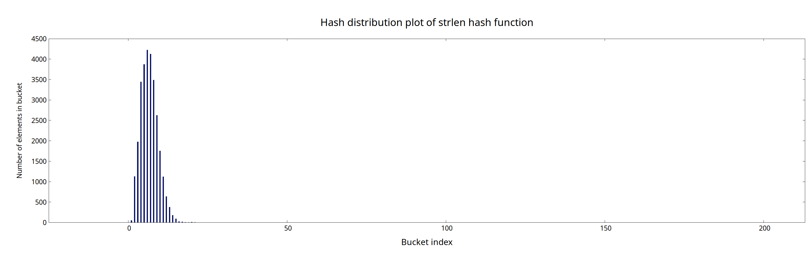
</p>

### "Коварная" контрольная сумма
#### Если размер хэш-таблицы 503
<p align="center">
    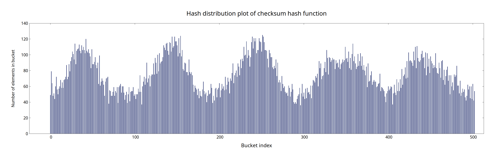
</p>

#### Если 5013
<p align="center">
    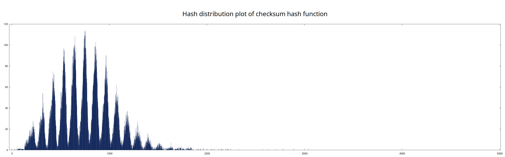
</p>

### Хэш djb2
<p align="center">
    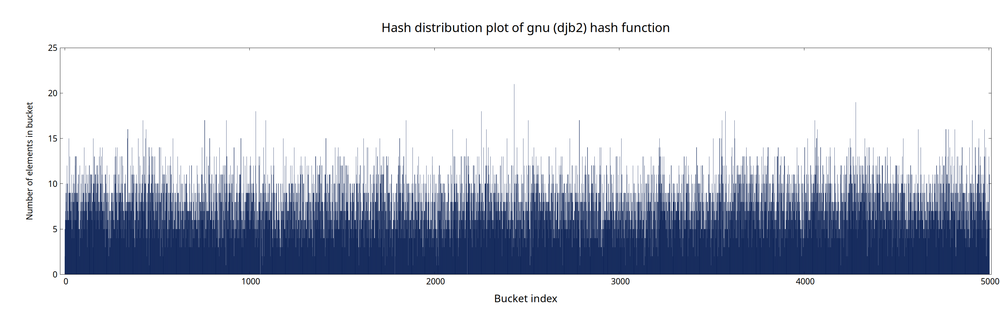
</p>

### Хэш "rol"
<p align="center">
    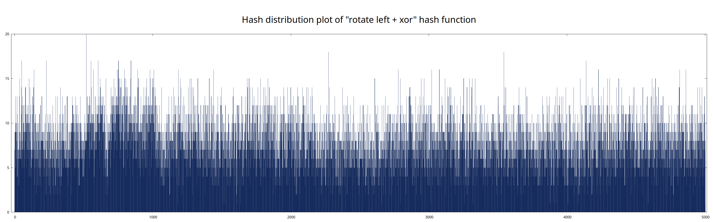
</p>

### Хэш "ror"
<p align="center">
    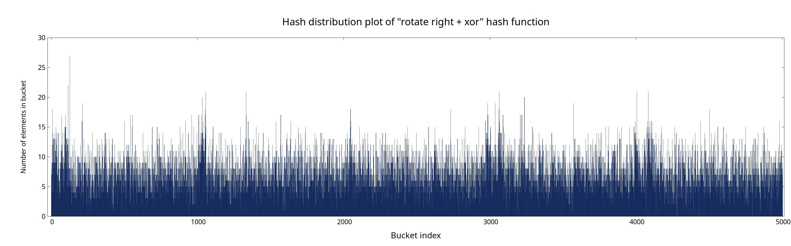
</p>

<table>
<tr>
<td><p align="center">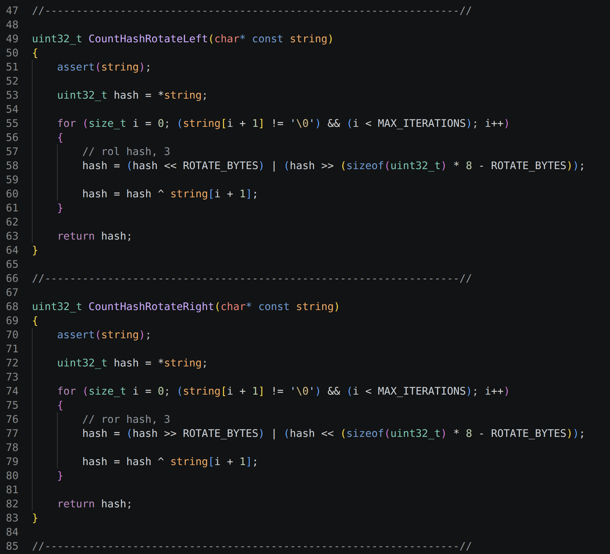</p></td>
<td><p align="center"></p></td>
</tr>
</table>

### Хэш crc32
<p align="center">
    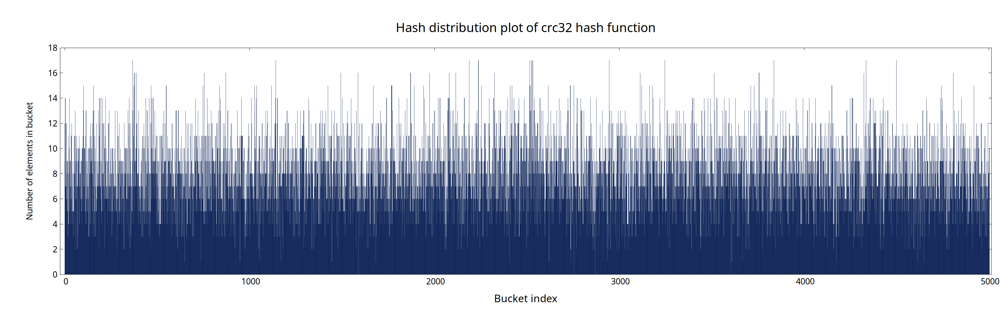
</p>

## Таблица дисперсий
| Хэш-функция            |        Дисперсия | Стандартное отклонение |
|-------|------|------|
| always one           |        46025.37 |          214.54 |
| first letter         |         1153.89 |           33.97 |
| strlen               |        18134.16 |          134.66 |
| checksum             |          329.26 |           18.15 |
| rol                  |            5.92 |            2.43 |
| ror                  |            6.87 |            2.62 |
| djb2                 |            5.64 |            2.37 |
| crc32                |            5.73 |            2.39 |

# Оптимизации

## Сравнение слов с помощью AVX инструкции

<p align="center">
    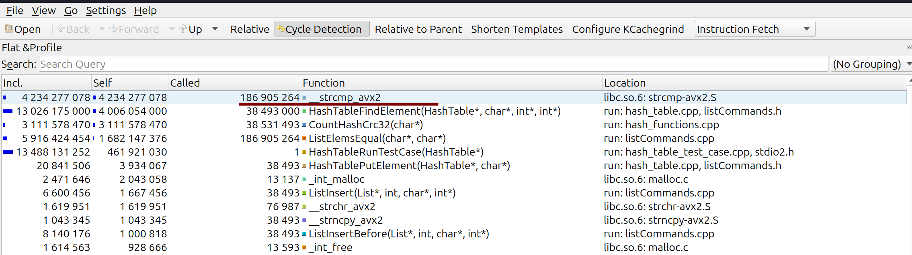
</p>
<p align="center">
    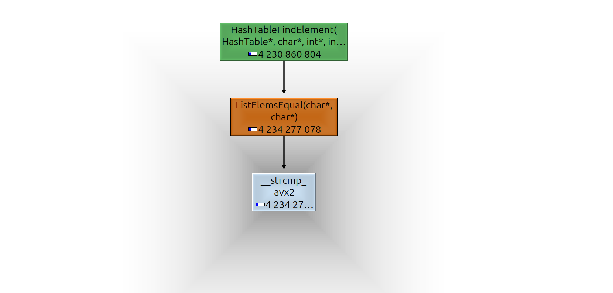
</p>
<p align="center">
    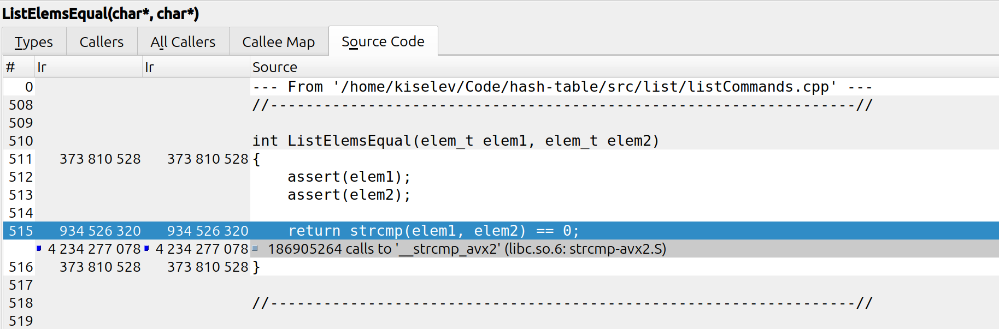
</p>

```cpp
int ListElemsEqual(__m256i mm_elem1, elem_t elem2)
{
    assert(elem2);

    __m256i mm_elem2 = _mm256_load_si256((__m256i*) elem2);

    __m256i mask = _mm256_cmpeq_epi16(mm_elem1, mm_elem2);

    return ~_mm256_cvtsi256_si32(mask) == 0;
}
```

### Ускорение на 33%

---

## Реализация функции поиска элемента в хэш-таблице на ассемблере


### Ускорение на % (?)

---

## Реализация хэш-функции crc32 с помощью ассемблерной вставки

<p align="center">
    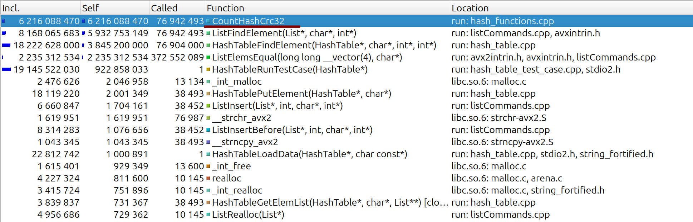
</p>

```cpp
uint32_t CountHashCrc32AsmInline(char* string)
{
    assert(string);

    uint64_t crc = 0xFFFFFFFF;

    asm ("crc32 %[crc], QWORD PTR [%[string] + 0 ]\n" 
         "crc32 %[crc], QWORD PTR [%[string] + 8 ]\n" 
         "crc32 %[crc], QWORD PTR [%[string] + 16]\n" 
         "crc32 %[crc], QWORD PTR [%[string] + 24]\n" 
         : [crc]    "+r" (crc) 
         : [string] "r"  (string)
         : "memory");

    // no remaining bytes as STR_MAX_SIZE % 8 == 0

    return crc ^ 0xFFFFFFFF;
}
```

### Ускорение на %

---

|Версия|Время, с|Ускорение относительно предыдущей версии | Ускорение относительно точки отсчета |
|:---|---:|---:|---:|
| Точка отсчета (без оптимизаций)    | 9.69 ± 0.04 | 1.00 | 1.00 |
| + Сравнение строк с avx            | 7.27 ± 0.04 | 1.33 | 1.33 |
| + HashTableFind на ассемблере      | 6.91 ± 0.04 | 1.05 | 2.05 |
| + Ассемблерная вставка crc32       | 4.72 ± 0.03 | 1.46 | 1.79 |

<!-- | Точка отсчета (без оптимизаций)    | 9.69 ± 0.04 | 1.00 | 1.00 | -->
<!-- | + Сравнение строк с avx            | 7.27 ± 0.04 | 1.33 | 1.33 | -->
<!-- | + Ассемблерная вставка crc32       | 5.40 ± 0.02 | 1.35 | 1.79 | -->
<!-- | + HashTableFind на ассемблере      | 4.72 ± 0.03 | 1.15 | 2.05 | -->

### Включим inlining между файлами с помощью флага -flto

|Версия|Время, с|Ускорение относительно предыдущей версии | Ускорение относительно точки отсчета |
|:---|---:|---:|---:|
| Без оптимизаций и без флага -flto         | 9.69 ± 0.04 | -    | -    |
| Точка отсчета (без оптимизаций и с -flto) | 9.02 ± 0.04 | 1.07 | 1.00 |
| + Сравнение строк с avx                   | 6.46 ± 0.02 | 1.40 | 1.40 |
| + Ассемблерная вставка crc32              | 4.48 ± 0.01 | 1.44 | 2.01 |
| + Флаг -O3                                | 4.44 ± 0.02 | 1.01 | 2.03 |